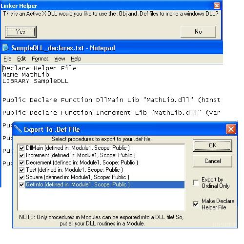



## Active X DLL Made Into Windows DLL

### Description

Ever want to make Windows DLLs or Windows Control Panel Applets But stuck With VB Active X DLLs?

Here is your answer: Now Includes: -.Def Maker Addin- Define Helper File Maker (Takes your exported functions and makes them defines for easier implementation) Def Maker (Allows you to choose routines to export)

-Linker Helper- Lets you choose to make your DLL or CPL windows compatible Still allows the use of resource files Sample DLL and dll test app Info to make your DLL callable from any programming environment

Updates:

Fixed Decrement in Dll test app

Fixed Sub Define Failure in define helper

See orig. Article: http://www.windowsdevcenter.com/pub/a/windows/2005/04/26/create_dll.html?page=1
 
### More Info
 

             |
---                |---
**Submitted On**   |2008-03-05 04:58:08
**By**             |[William W](https://github.com/Planet-Source-Code/PSCIndex/blob/master/ByAuthor/william-w.md)
**Level**          |Beginner
**User Rating**    |5.0 (20 globes from 4 users)
**Compatibility**  |VB 6\.0
**Category**       |[VB function enhancement](https://github.com/Planet-Source-Code/PSCIndex/blob/master/ByCategory/vb-function-enhancement__1-25.md)
**World**          |[Visual Basic](https://github.com/Planet-Source-Code/PSCIndex/blob/master/ByWorld/visual-basic.md)
**Archive File**   |[Active\_X\_D210515372008\.zip](https://github.com/Planet-Source-Code/william-w-active-x-dll-made-into-windows-dll__1-70175/archive/master.zip)

